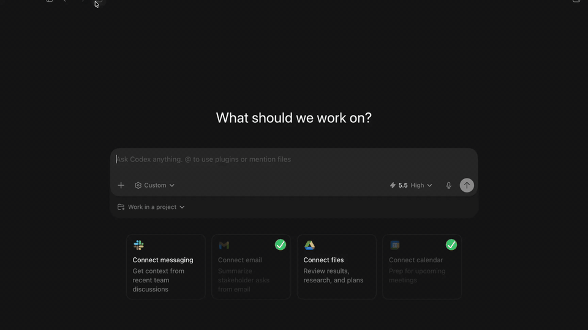
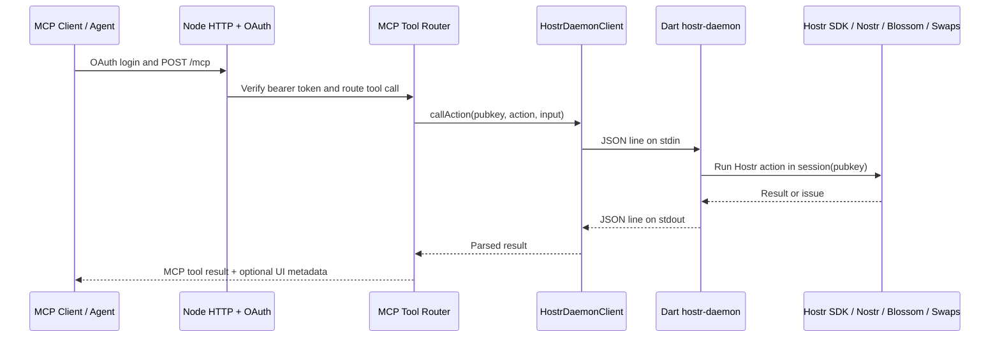

# AI

Hostr's AI surface is the MCP server that lets an agent search listings, manage a Hostr session, create or edit listings, negotiate reservations, handle payments, upload images, and inspect trips/bookings through the same SDK paths used by the app.



## Structure

```bash
../../ai
└── mcp-server          # Node/TypeScript HTTP MCP server

../../hostr_cli
├── bin/hostr_daemon.dart
└── lib/src/daemon     # Dart stdio daemon used by MCP
```

- MCP server source: `ai/mcp-server`
- Detailed MCP runtime README: [`ai/mcp-server/README.md`](../source/ai/mcp-server/README.md)
- Daemon overview: [`./daemon/README.md`](./daemon/README.md)
- Action catalog source of truth: [`hostr_cli/lib/src/actions/hostr_actions.dart`](../source/hostr_cli/lib/src/actions/hostr_actions.dart)

## How the MCP Server Runs

The MCP server is a Node 22 service built from [`ai/mcp-server/src/index.ts`](../source/ai/mcp-server/src/index.ts). At startup it:

1. Reads environment config from [`ai/mcp-server/src/config.ts`](../source/ai/mcp-server/src/config.ts).
2. Creates a `HostrDaemonClient`.
3. Creates the Express app.
4. Serves HTTP on `PORT`, defaulting to `8787`.

The HTTP app exposes:

| Route | Purpose |
| ----- | ------- |
| `GET /health` | Lightweight process/config health. |
| `GET /ready` | Readiness check that calls daemon `describe`. |
| `POST /mcp` | Streamable HTTP MCP endpoint. |
| `POST /mcp/uploads/images` | Raw image upload path for MCP clients that can stream files. |
| `/oauth/*` and `/.well-known/oauth*` | OAuth metadata, dynamic client registration, authorization, and token flow. |
| `/assets/*` | Temporary payment QR/invoice assets returned by payment workflows. |

In local source mode:

```bash
cd ai/mcp-server
npm run dev:local
```

This serves:

```text
http://127.0.0.1:8787/mcp
```

The local helper sets the daemon command to:

```text
HOSTR_DAEMON_COMMAND=dart
HOSTR_DAEMON_ARGS="bin/hostr_daemon.dart --stdio --env development"
HOSTR_DAEMON_CWD=../../hostr_cli
HOSTR_DAEMON_STATE_DIR=../../docker/data/mcp-local
```

In Docker, [`ai/mcp-server/Dockerfile`](../source/ai/mcp-server/Dockerfile) builds the TypeScript server and an AOT Dart daemon bundle. The runtime container then runs:

```text
HOSTR_DAEMON_COMMAND=/opt/hostr-daemon/bin/hostr_daemon
HOSTR_DAEMON_CWD=/opt/hostr-daemon
HOSTR_DAEMON_STATE_DIR=/data/mcp
```

The compose service is named `mcp`. In local compose, `ai.hostr.development` prefers the source server on the macOS host at `host.docker.internal:8787` and falls back to the Docker MCP container when that source server is not running.

## MCP to Daemon Flow



Node owns client-facing protocol concerns: OAuth, MCP resources/tools, HTTP uploads, request tracing, widgets, and public asset URLs. Dart owns Hostr behavior: session state, Nostr Connect, relay queries, listing/reservation models, Blossom uploads through an authenticated session, swaps, and escrow-aware actions.

## Auth and Sessions

MCP calls use OAuth bearer tokens. The token's `pubkey` claim selects the Hostr daemon session:

```text
context.runtime.session(pubkey)
```

Write actions should not accept a pubkey in tool input. The bridge passes the token pubkey separately, and the daemon rejects authenticated writes when the active Hostr session does not match that token.

If the OAuth token is still valid but the NIP-46 signer is offline, tools return `auth_required` with a `sessionAction` hint. The agent should call `hostr_session_connect`, show the returned Nostr Connect URI or QR image, then wait for the signer approval.

## Development Notes

- Edit action definitions in Dart first, then regenerate MCP types with:
  ```bash
  cd hostr_cli
  dart run bin/generate_mcp_types.dart /path/to/hostr
  ```
- Run MCP checks from `ai/mcp-server`:
  ```bash
  npm run typecheck
  npm run test:unit
  ```
- Keep daemon stdout reserved for JSON responses. Logs belong on stderr so the Node bridge can parse stdout safely.
- `HOSTR_DAEMON_TIMEOUT_MS` defaults to `120000`. On timeout, the Node bridge sends a cooperative daemon `cancel` request.
