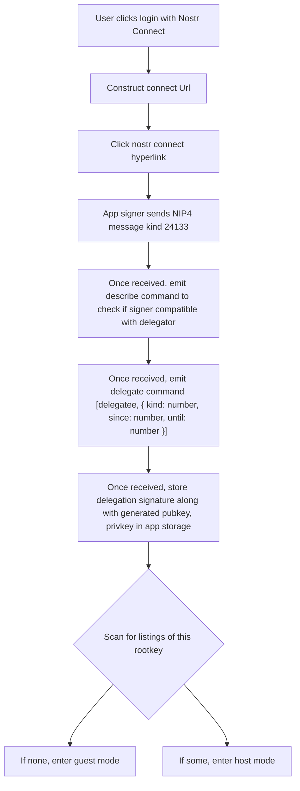

User clicks login with Nostr Connect

E.g. nostr connect hyperlink `nostrconnect://<pubkey>?relay=${encodeURIComponent("wss://relay.hostr.io")}&metadata=${encodeURIComponent(JSON.stringify({"name": "Hostr"}))}`

