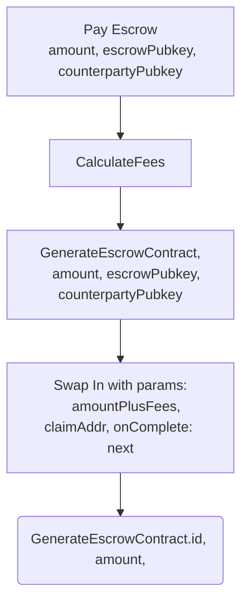
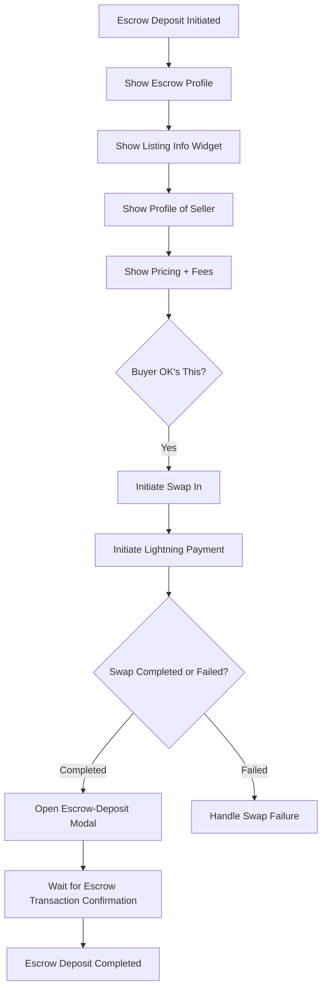

# Escrow

We deposit using our EVM balance, usually after a swap in.



```dart
class EscrowDepositManager extends Cubit<Map<String, dynamic>> {
  final SwapManager swapManager;
  final RpcClient rpcClient;
  Map<String, dynamic> pendingDeposits = {};

  EscrowDepositManager(this.swapManager, this.rpcClient) : super({});

  void initiateEscrowDeposit(double amount, String escrowPubkey, String counterpartyPubkey) {
    final depositId = DateTime.now().millisecondsSinceEpoch.toString();
    pendingDeposits[depositId] = {
      'amount': amount,
      'escrowPubkey': escrowPubkey,
      'counterpartyPubkey': counterpartyPubkey,
      'status': 'initiated'
    };
    emit(pendingDeposits);

    swapManager.swapIn(amount);
    swapManager.stream.listen((swapStatus) {
      if (swapStatus == 'Completed') {
        _completeEscrowDeposit(depositId);
      }
    });
  }

  void _completeEscrowDeposit(String depositId) {
    final deposit = pendingDeposits[depositId];
    if (deposit != null) {
      final amount = deposit['amount'];
      final escrowPubkey = deposit['escrowPubkey'];
      final counterpartyPubkey = deposit['counterpartyPubkey'];

      // Create and broadcast the escrow transaction
      rpcClient.createEscrowTransaction(amount, escrowPubkey, counterpartyPubkey).then((txHash) {
        deposit['status'] = 'completed';
        deposit['txHash'] = txHash;
        emit(pendingDeposits);
      }).catchError((error) {
        deposit['status'] = 'failed';
        emit(pendingDeposits);
      });
    }
  }

  void resumePendingDeposits() {
    pendingDeposits.forEach((depositId, deposit) {
      if (deposit['status'] == 'initiated') {
        swapManager.swapIn(deposit['amount']);
        swapManager.stream.listen((swapStatus) {
          if (swapStatus == 'Completed') {
            _completeEscrowDeposit(depositId);
          }
        });
      }
    });
  }
```


