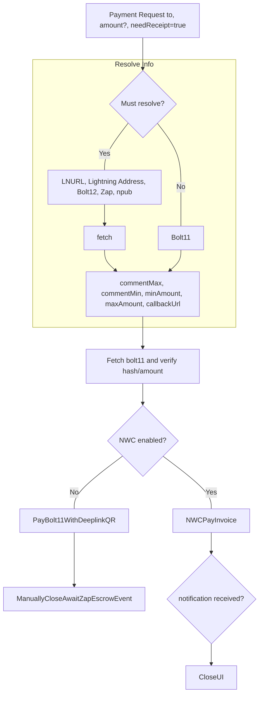

# Payment

A payment can be either a Bolt11 invoice, Bolt12 offer, LNURL string, Lightning Address, Zap, or npub. Unless a fixed user-requested amount has already been set, the flow should be as follows:



Payments requests, triggered by components in the app, should queue until they are next to be processed. Edge case.

### Payments for swaps

When we swap funds from lightning into EVM balance, the preimage from the swap invoice we paid is used to claw back the funds if something goes wrong. We also generate this preimage, so we must store this safely.

When we swap from EVM to lightning, we don't need receipt from lightning that payment was made. As we can just reclaim our EVM balance after a timeout if it has not been claimed. Movement of the EVM funds indicate success or failure.

### Payments Manager / Ephemeral

```dart
class PaymentManager {
  List<PaymentCubit> payments = [];

  void initiatePayment(double amount) {
    var paymentCubit = PaymentCubit(amount);
    payments.add(paymentCubit);
    emit(paymentCubit)

    paymentCubit.stream.listen((paymentStatus) {
      if (paymentStatus is TerminalPaymentState) {
        payments.remove(paymentCubit);
      }
    });
  }
}
```

```dart
class PaymentCubit extends Cubit<String> {
  final double amount;
  final String to;

  PaymentCubit(this.amount) : super('Initialized');

  void resolve()

  void confirm()

  void listenForResponse()
}
```

Consume payment requests visually

```dart
// Listen to PaymentManager for new payments

BlocListener<PaymentManager, PaymentCubit?>(
  listener: (context, paymentCubit) {
    if (paymentCubit != null) {
      /// Trigger resolution of this payments details
      paymentCubit.resolve();
      /// Open payment modal
      openModal(paymentCubit);
    }
  }
)
```
