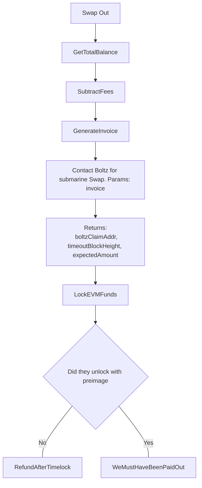
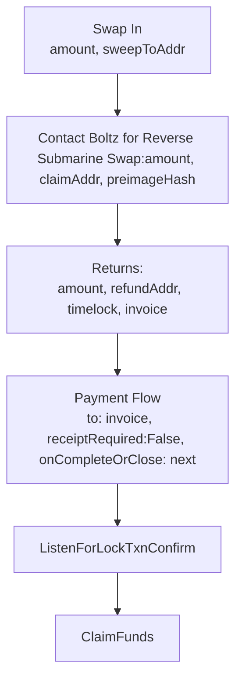

## Swap out (Submarine Swap)

A swap-out occurs after an escrow has paid the seller out on the EVM chain.
The funds now need to be swept back to lightning.

```diff
How can we get cought out?

- We lock our funds in the lock TXN and never refund ourselves

- We overpay fees
```



## Swap in (Reverse Submarine Swap)

A swap-in (reverse submarine swap) only happens when we are bridging to an EVM layer for escrow services. Once we are swapped in, the keys of our app (AKA the nsec) is the key for spending the funds into the escrow, and sweeping funds out of escrow upon completion.

```diff
How can we get cought out?

- We receive preimage from the paid invoice, but never claim our funds due to closed app

- Preimage that we require to claim the funds is lost
+ Allow input such that user can manually paste preimage if the payment notification event gets lost in nostr

- We pay an invoice without checking it's hash corresponds to preimage we generated

- We overpay fees

- We require relay to broadcast claim, since no EVM funds in claimerAddr on first swap-in
```


