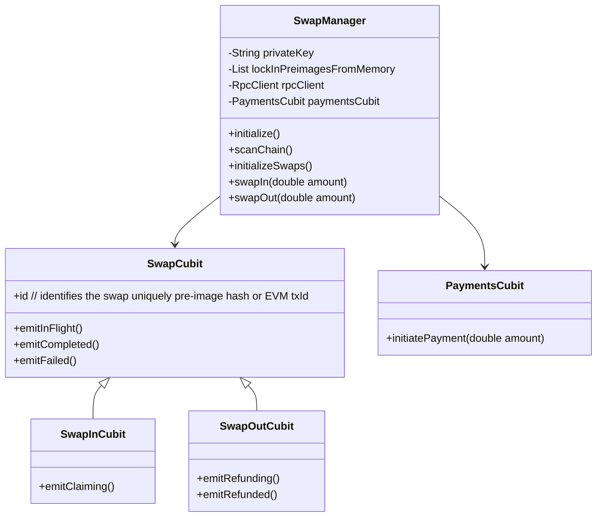

## Swap Manager (Hydrated)

The swap manager is a global service that can run independently from UI (may need to be run in [background](https://pub.dev/packages/flutter_background_service)) when possible.

Swap manager should be a hydrated cubit, such that it remembers the latest scanned part of the chain.

- We need to make sure that if two instances of swap manager are running, they do not broadcast competing transactions. If they deterministically create the same transactions, should these be rejected by network and don't risk double-paying fees?



```dart
import 'package:flutter_bloc/flutter_bloc.dart';
import 'payment_cubit.dart';

class SwapManager extends Cubit<String> {
  String privateKey;
  List<String> lockInPreimagesFromMemory;
  RpcClient rpcClient;
  List<SwapCubit> swaps = [];
  PaymentsCubit paymentsCubit;

  SwapManager(this.privateKey, this.lockInPreimagesFromMemory, this.rpcClient, this.paymentsCubit) : super('Initialized') {
    paymentsCubit.stream.listen((paymentStatus) {
      // Handle payment status updates
    });
  }

  void initialize() {
    scanChain();
    initializeSwaps();
  }

  void scanChain() {
    // Logic to scan the EVM chain for pending swaps
    // Populate the swaps list with SwapInCubit or SwapOutCubit instances
  }

  void initializeSwaps() {
    for (var swap in swaps) {
      swap.checkStatus();
    }
  }

  void swapIn(double amount) {
    var swapInCubit = SwapInCubit();
    swaps.add(swapInCubit);
    emit('InFlight');
    paymentsCubit.initiatePayment(amount);
    paymentsCubit.stream.listen((paymentStatus) {
      if (paymentStatus == 'Completed') {
        swapInCubit.emitCompleted();
        emit('Completed');
      } else if (paymentStatus == 'Failed') {
        swapInCubit.emitFailed();
        emit('Failed');
      }
    });
  }

  void swapOut(double amount) {
    var swapOutCubit = SwapOutCubit();
    swaps.add(swapOutCubit);
    emit('InFlight');
    // Additional logic for swap out
  }
}
```

The swap manager might then be consumed like this

```dart
@override
Widget build(BuildContext context) {
  return MultiBlocProvider(
    providers: [
      BlocProvider<SwapManager>(
        create: (context) => swapManager,
      ),
      ...swapManager.swaps.map((swap) => BlocProvider.value(value: swap)),
    ],
    child: MaterialApp(
      home: SwapListScreen(),
    ),
  );
}
```
