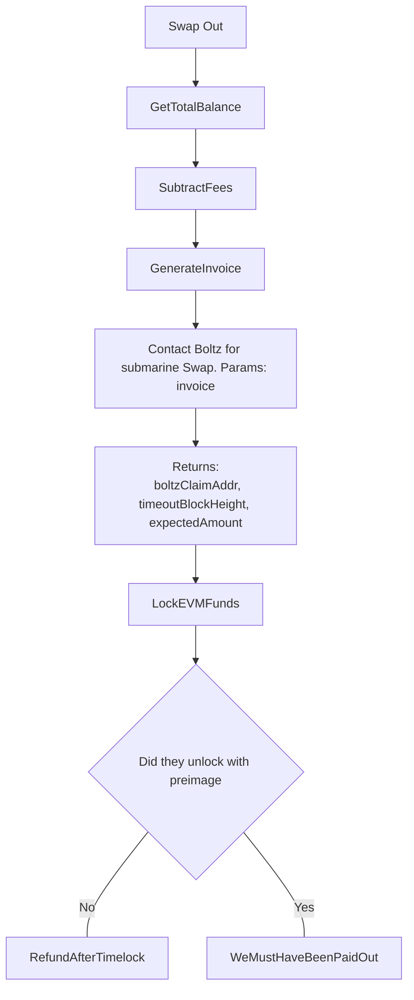

# Swap out (Submarine Swap)

A swap-out occurs after an escrow has paid the seller out on the EVM chain.
The funds now need to be swept back to lightning.

```diff
How can we get cought out?

- We lock our funds in the lock TXN and never refund ourselves

- We overpay fees
```


