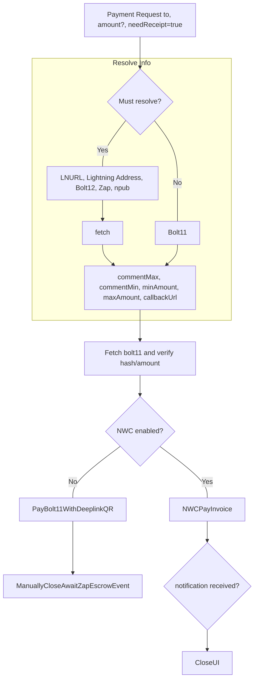

# Conversation Page

Conversations consist of wrapped messages between a seller and hoster, and contain direct messages and reservation requests.

A thread must reference a particular unique ID, primarily set by an initial `ReservationRequest` sent either by the host to the guest, or guest to the host.

