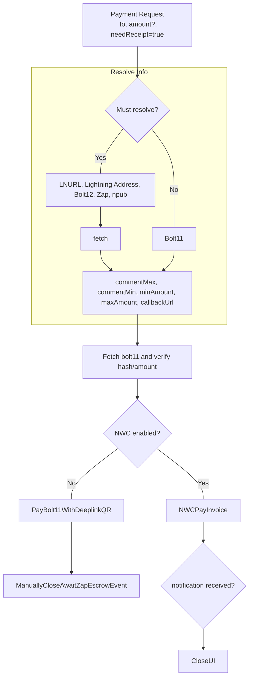
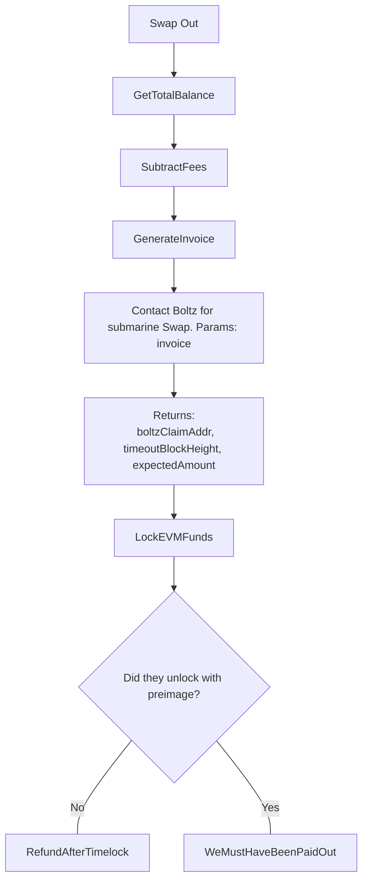
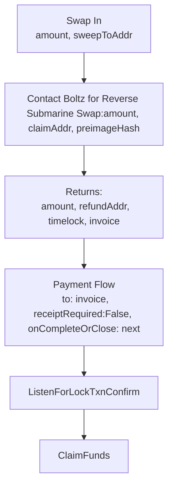
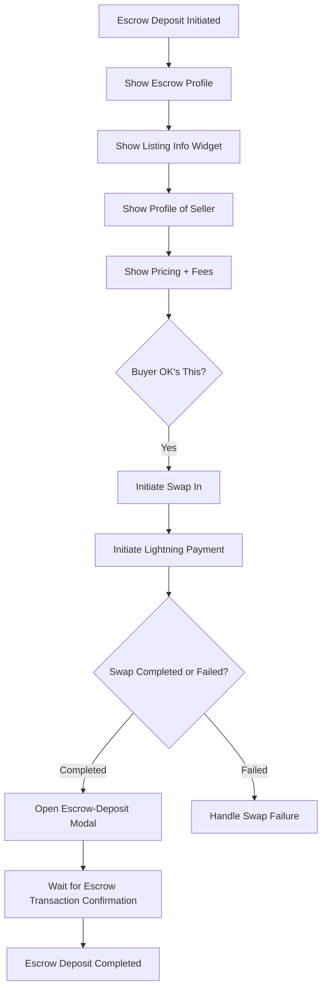
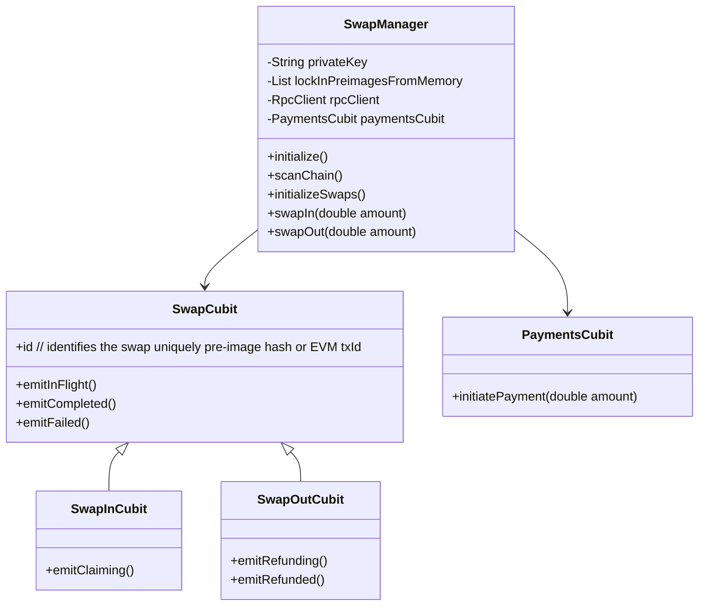

# Hostr Client

[](https://codecov.io/gh/sudonym-btc/hostr)

This is a client that displays and posts events related to short term accommodation lets over the nostr network.

## Getting Started

Install [Flutter](https://docs.flutter.dev/get-started/install)
By default flutter launches in `mock` mode. It will not attempt to connect to relays or swap services. To connect to other environments, check the VSCode debug launcher.

```bash
flutter run
```

## Structure

```bash
./lib
├── config            # Configs like default relays and EVM-RPC URLs
├── core              # Utils and mic
├── data
    ├── models        # Data models and mock data
    └── repositories  # Classes for fetching certain types of data
├── logic             # How data flows through app
├── presentation      # How data looks
└── README.md
```

## NIPs Utilized

- **NIP-01**: Basic protocol for event creation and subscription.
- **NIP-04**: Encrypted direct messages for secure communication between hosts and guests.
- **NIP-05**: Mapping Nostr keys to DNS-based internet identifiers.
- **NIP-09**: Event deletion for removing listings or messages.
- **NIP-33**: Parameterized replaceable events for creating and updating listings and bookings.

## Nostr Synchronization

### Hydrated cubits

[Hydrated](https://pub.dev/packages/hydrated_bloc) blocs are used to persist state between app relaunched, preventing re-sync upon every usage.
Hydrated blocs must be cleared on logout.

### List cubit

A list cubit listens to a filter and starts a subscription stream instance with a specific filter. Emitting from the filter cubit will trigger the list state to reset.
Use a postFilter cubit to emit a predicate that filters fetched results based on parameters that can't be filtered for via Nostr requests directly.
A sort cubit determines how the results are ordered.

```dart
class ListCubit<NostrEvent> {
  FilterCubit filter;
  PostResultFilterCubit postFilter;
  SortCubit sort;
}
```

It has the following methods:

`Load new`

```dart
startRequestAndCloseOnEOSE
{
  until: null,
  since: max(items.createdAt)
}
```

`Load next`

```dart
startRequestAndCloseOnEOSE
{
  until: min(items.createdAt),
  since: null
}
```

`Load all`

```dart
// Limit not required, will load all.
loadNew()

//If limit was imposed by the relay, try fetching next batch until nothing returnes
while(await loadNext()) do

emit(State.copyWith({status: Synching}))
```

The class emits:

```dart
Idle          // Used when not doing anything or listening
Listening     // Used when synched and awaiting new events
LoadingNext   // Used when fetching older events
Synching      // Used when loading next in a loop
Failed        // Used when all relays fail to respond correctly
```

### Messaging cubit (Hydrated)

The messaging cubit is responsible for loading and storing all `kind 14` private and encrypted DMs. Since messages include reservation offers made & received, it's vital that this stays up-to-date and is synched upon app login. Since private DMs are sent using a random pubkey for added privacy, it is not possible to search for messages from/to our OWN pubkey to load relevant messages. Nostr NIP [17](https://github.com/nostr-protocol/nips/blob/master/17.md) recomemends giftwrapping the message and sending it from randomized keys to us and to the real receiver.

Before a user can interact in the inbox, the message stream must have received `EOSE` for all connected relays using filter

```json
{
  kinds [1059],
  tags: [
    ["p", userPubkey]
  ]
}
```

This stream, when completed, will hold a state of all messages ever received.

```dart
/// This list should stay in memory for the duration of a user sign in
class MessagingCubit extends ListCubit<Message> with HydratedMixin {
  kinds: [14],
  List<ThreadCubit> threads

  init() {
    items.listen((message) {
      addToThread(message)
    })
  }

  addToThread(NostrEvent message) {

  }
}
class MessagingCubitState {
  List<ThreadCubit>
}
```

```dart
class ThreadCubit extends Cubit<> {

}
```

### Search

### Reservation Checker Cubit

The reservation checker cubit can listen to the search list results, and query corresponding reservations as needed.

For each search result which matches the postResultFilter filter we need to fetch reservations to check availability.
This is difficult, because one listing could have hundreds of reservations, or many listings could have no reservations.
In the first iteration, we can just query each listing individually.

We could potentially load multiple listing's reservations using one `NostrFilter` by inputting multiple `d` tags.

For each result in our results list, we need to query all reservations as there is no way to filter based on date range.

Once each synch event fires, indicating that reservations have completely loaded for a set of listings, we need to update the search postResultFilter predicate to exclude those items, or reorder the list.

### Reviews

Reviews use Nostr kind 14. They can include tags such as tags: [['cleanliness', 1], ['checkIn', 0.6]]. The content can be the comment that the guest wishes to leave.

The review event should include a tag with commitment pre-image, that only the owner of the reservation knows, 

```dart
tags.append(["e", liked.id])
tags.append(["p", liked.pubkey])
tags.append(["a", liked.tags[a]]),
tags.append(["commit_preimage", reservation.reservation_request.preimage])

```

## Payments

A payment can be either a Bolt11 invoice, Bolt12 offer, LNURL string, Lightning Address, Zap, or npub. Unless a fixed user-requested amount has already been set, the flow should be as follows:



Payments requests, triggered by components in the app, should queue until they are next to be processed. Edge case.

### Payments for swaps

When we swap funds from lightning into EVM balance, the preimage from the swap invoice we paid is used to claw back the funds if something goes wrong. We also generate this preimage, so we must store this safely.

When we swap from EVM to lightning, we don't need receipt from lightning that payment was made. As we can just reclaim our EVM balance after a timeout if it has not been claimed. Movement of the EVM funds indicate success or failure.

### Payments Manager / Ephemeral

```dart
class PaymentManager {
  List<PaymentCubit> payments = [];

  void initiatePayment(double amount) {
    var paymentCubit = PaymentCubit(amount);
    payments.add(paymentCubit);
    emit(paymentCubit)

    paymentCubit.stream.listen((paymentStatus) {
      if (paymentStatus is TerminalPaymentState) {
        payments.remove(paymentCubit);
      }
    });
  }
}
```

```dart
class PaymentCubit extends Cubit<String> {
  final double amount;
  final String to;

  PaymentCubit(this.amount) : super('Initialized');

  void resolve()

  void confirm()

  void listenForResponse()
}
```

Consume payment requests visually

```dart
// Listen to PaymentManager for new payments

BlocListener<PaymentManager, PaymentCubit?>(
  listener: (context, paymentCubit) {
    if (paymentCubit != null) {
      /// Trigger resolution of this payments details
      paymentCubit.resolve();
      /// Open payment modal
      openModal(paymentCubit);
    }
  }
)
```

## Swap out (Submarine Swap)

A swap-out occurs after an escrow has paid the seller out on the EVM chain.
The funds now need to be swept back to lightning.

```diff
How can we get cought out?

- We lock our funds in the lock TXN and never refund ourselves

- We overpay fees
```



## Swap in (Reverse Submarine Swap)

A swap-in (reverse submarine swap) only happens when we are bridging to an EVM layer for escrow services. Once we are swapped in, the keys of our app (AKA the nsec) is the key for spending the funds into the escrow, and sweeping funds out of escrow upon completion.

```diff
How can we get cought out?

- We receive preimage from the paid invoice, but never claim our funds due to closed app

- Preimage that we require to claim the funds is lost
+ Allow input such that user can manually paste preimage if the payment notification event gets lost in nostr

- We pay an invoice without checking it's hash corresponds to preimage we generated

- We overpay fees

- We require relay to broadcast claim, since no EVM funds in claimerAddr on first swap-in
```



## Escrow

We deposit using our EVM balance.


```
class EscrowDepositManager extends Cubit<Map<String, dynamic>> {
  final SwapManager swapManager;
  final RpcClient rpcClient;
  Map<String, dynamic> pendingDeposits = {};

  EscrowDepositManager(this.swapManager, this.rpcClient) : super({});

  void initiateEscrowDeposit(double amount, String escrowPubkey, String counterpartyPubkey) {
    final depositId = DateTime.now().millisecondsSinceEpoch.toString();
    pendingDeposits[depositId] = {
      'amount': amount,
      'escrowPubkey': escrowPubkey,
      'counterpartyPubkey': counterpartyPubkey,
      'status': 'initiated'
    };
    emit(pendingDeposits);

    swapManager.swapIn(amount);
    swapManager.stream.listen((swapStatus) {
      if (swapStatus == 'Completed') {
        _completeEscrowDeposit(depositId);
      }
    });
  }

  void _completeEscrowDeposit(String depositId) {
    final deposit = pendingDeposits[depositId];
    if (deposit != null) {
      final amount = deposit['amount'];
      final escrowPubkey = deposit['escrowPubkey'];
      final counterpartyPubkey = deposit['counterpartyPubkey'];

      // Create and broadcast the escrow transaction
      rpcClient.createEscrowTransaction(amount, escrowPubkey, counterpartyPubkey).then((txHash) {
        deposit['status'] = 'completed';
        deposit['txHash'] = txHash;
        emit(pendingDeposits);
      }).catchError((error) {
        deposit['status'] = 'failed';
        emit(pendingDeposits);
      });
    }
  }

  void resumePendingDeposits() {
    pendingDeposits.forEach((depositId, deposit) {
      if (deposit['status'] == 'initiated') {
        swapManager.swapIn(deposit['amount']);
        swapManager.stream.listen((swapStatus) {
          if (swapStatus == 'Completed') {
            _completeEscrowDeposit(depositId);
          }
        });
      }
    });
  }
```



## Swap Manager (Hydrated)

The swap manager is a global service that can run independently from UI (may need to be run in [background](https://pub.dev/packages/flutter_background_service)) when possible.

Swap manager should be a hydrated cubit, such that it remembers the latest scanned part of the chain.

- We need to make sure that if two instances of swap manager are running, they do not broadcast competing transactions. If they deterministically create the same transactions, should these be rejected by network and don't risk double-paying fees?



```dart
import 'package:flutter_bloc/flutter_bloc.dart';
import 'payment_cubit.dart';

class SwapManager extends Cubit<String> {
  String privateKey;
  List<String> lockInPreimagesFromMemory;
  RpcClient rpcClient;
  List<SwapCubit> swaps = [];
  PaymentsCubit paymentsCubit;

  SwapManager(this.privateKey, this.lockInPreimagesFromMemory, this.rpcClient, this.paymentsCubit) : super('Initialized') {
    paymentsCubit.stream.listen((paymentStatus) {
      // Handle payment status updates
    });
  }

  void initialize() {
    scanChain();
    initializeSwaps();
  }

  void scanChain() {
    // Logic to scan the EVM chain for pending swaps
    // Populate the swaps list with SwapInCubit or SwapOutCubit instances
  }

  void initializeSwaps() {
    for (var swap in swaps) {
      swap.checkStatus();
    }
  }

  void swapIn(double amount) {
    var swapInCubit = SwapInCubit();
    swaps.add(swapInCubit);
    emit('InFlight');
    paymentsCubit.initiatePayment(amount);
    paymentsCubit.stream.listen((paymentStatus) {
      if (paymentStatus == 'Completed') {
        swapInCubit.emitCompleted();
        emit('Completed');
      } else if (paymentStatus == 'Failed') {
        swapInCubit.emitFailed();
        emit('Failed');
      }
    });
  }

  void swapOut(double amount) {
    var swapOutCubit = SwapOutCubit();
    swaps.add(swapOutCubit);
    emit('InFlight');
    // Additional logic for swap out
  }
}
```

The swap manager might then be consumed like this

```dart
@override
Widget build(BuildContext context) {
  return MultiBlocProvider(
    providers: [
      BlocProvider<SwapManager>(
        create: (context) => swapManager,
      ),
      ...swapManager.swaps.map((swap) => BlocProvider.value(value: swap)),
    ],
    child: MaterialApp(
      home: SwapListScreen(),
    ),
  );
}
```

## UI

### Shared

- **Profile page**
  - Image, name, description, NIP05, Zap button
  - **Edit page**
- **Listing page**
  - Reviews and ratings, reservations, description, pricing
  - If guest mode:
    - Calendar preloaded with unavailable dates
    - Reserve button only active once all reservations are fetched and validated
  - If host mode:
    - Show calendar by default
    - `Reservation` can be made instantly and for zero cost to block dates
  - **Edit page**
- **Wallet Page**
  - Shows current wallet connection, allows user to reconnect if required
  - List of current in-flight payments
  - List of trusted escrow providers
- **Messaging page**
  - Shows list of messages grouped by `pubkey:a`, identifies the conversation by user and reservation request anchor
  - List item
    - Counterparty name and avatar
    - Text of incoming or outgoing message, replaced with italic text if:
      - Last message was a reservation request: 'Alex requested a 2 night stay'
      - Look for `reservation` with commit_hash of `reservation request`, if exists, add "booking confirmed" icon to chat.
  - Conversation page
    - Header
      - If host
        - Attempt to fetch zaps to prove payment
        - Attempt to use lookup_invoice to check if invoices attached to reservation_requests have been paid
        - Attempt to use EVM to check if money in lockup
      - Show profile of counterparty
        - Fetch `reservation` which references the anchor of this conversation.
          - If stay is in future: "Alex is booked to be hosted by you Jan 3 - Jan 6"
        - If null, fetch most recent `reservation_request` of this conversation anchor. "Alex has requested to stay 3 night, Jan 3 - 6, for 60k sats" or "You offered to host Alex for 3 nights, Jan 3- 6, for 60k sats" Accept (Change) - can change price if allowBarter is true, can change dates if counterparty is host.
          - Host
            - Accept
              - Require upfront payment?
               - Can generate expiring invoice? Attach to listing
              - Don't require upfront payment? Sends back signed reservation with commit_hash of buyers request
            - *Can use NWC to generate expiring invoice*.
            - Change
    - Fetches each message in the conversation and unwraps/parses if necessary
    - Combines with `reservation` list cubit where tag `commit_hash` is equal to first messages `commit_hash` tag
    - For each item in the conversation
      - If of reservation type:
        - Show "booking confirmed" widget.
      - If of message type:
        - If wraps a reservation request display the offer widget
        - Else display the message plaintext

## Improvements

- Swap in transaction should go straight into the contract
- Escrow contract COULD encode bolt12, and then escrcow can do the swap by proving they paid a corresponding bolt11 invoice and releasing the funds to themselves. Out of scope.

## Assets

The `assets` directory houses images, fonts, and any other files you want to
include with your application.

The `assets/images` directory contains [resolution-aware
images](https://flutter.dev/docs/development/ui/assets-and-images#resolution-aware).

## Localization

This project generates localized messages based on arb files found in
the `lib/_localization` directory.

To support additional languages, please visit the tutorial on
[Internationalizing Flutter
apps](https://flutter.dev/docs/development/accessibility-and-localization/internationalization)

## Seed relay

<!-- TODO export the JSON as a file such that it can be loaded straight into the relay from the docker-up command -->

```bash
flutter run lib/data/mock/seed_relay.dart
```
