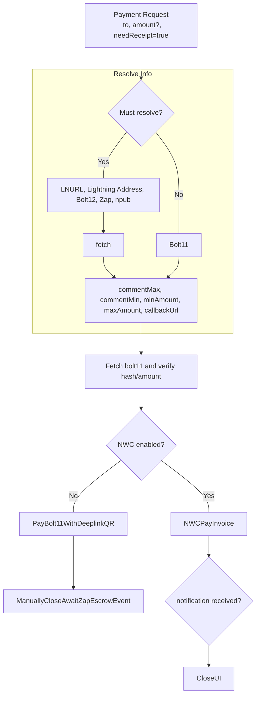
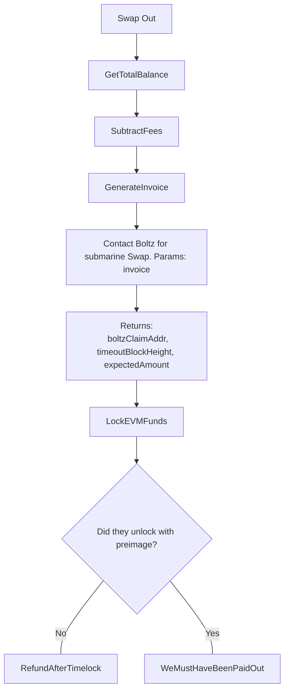
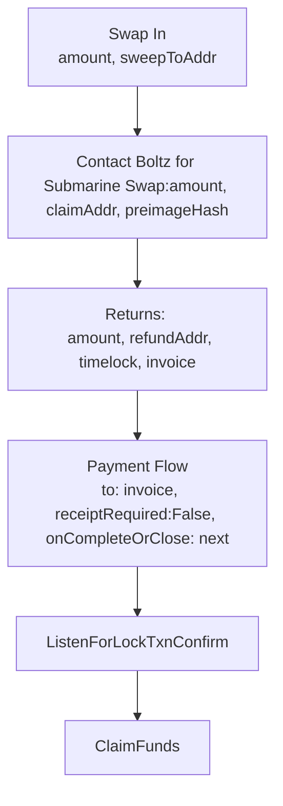
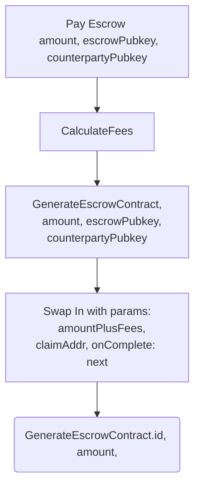

# Hostr Client

This is a client that displays and posts events related to short term accommodation lets over the nostr network.

## Getting Started

Install [Flutter](https://docs.flutter.dev/get-started/install)
By default flutter launches in `mock` mode. It will not attempt to connect to relays or swap services. To connect to other environments, check the VSCode debug launcher.
```bash
flutter run
```


## Structure

```bash
./lib
├── config            # Configs like default relays and EVM-RPC URLs
├── core              # Utils and mic
├── data   
    ├── models        # Data models and mock data
    └── repositories  # Classes for fetching certain types of data
├── logic             # How data flows through app
├── presentation      # How data looks
└── README.md               
```

## NIPs Utilized

- **NIP-01**: Basic protocol for event creation and subscription.
- **NIP-04**: Encrypted direct messages for secure communication between hosts and guests.
- **NIP-05**: Mapping Nostr keys to DNS-based internet identifiers.
- **NIP-09**: Event deletion for removing listings or messages.
- **NIP-33**: Parameterized replaceable events for creating and updating listings and bookings.

## Nostr Synchronization

### Lister state

A lister takes a filter and starts a subscription stream instance with a specific filter.

```dart
class StreamCubit<T extends NostrEvent>() {
  NostrFilter filter;
  Func(T)=>bool includeEventPredicate;
  Func(T a, T b) => 0, -1, 1 order;

  StreamCubit({
    required this.filter,

    // By default include all received events
    this.includeEventPredicate = (T event) => true
  })
}
```

It has the following methods:

`Close`

```dart
Close all subscriptions to relays
```

`setIncludeEventPredicate`

```dart
Allows adjusting of post result predicate to update client-side search results
```

`Load new`

```dart
startRequestAndCloseOnEOSE
{
  until: null,
  since: max(items.createdAt)
}
```

`Load next`

```dart
startRequestAndCloseOnEOSE
{
  until: min(items.createdAt),
  since: null
}
```

`Load all`

```dart
// Limit not required, will load all.
loadNew()

//If limit was imposed by the relay, try fetching next batch until nothing returnes
while(await loadNext()) do

emit(State.copyWith({status: Synching}))
```

`setOrdering`

```dart
// Reorder results by new order function
```

The class emits:

```dart
Idle          // Used when not doing anything or listening
Listening     // Used when synched and awaiting new events
LoadingNext   // Used when fetching older events
Synching      // Used when loading next in a loop
Failed        // Used when all relays fail to respond correctly
```

### Hydrated cubits

[Hydrated](https://pub.dev/packages/hydrated_bloc) blocs are used to persist state between app relaunched, preventing re-sync upon every usage.
Hydrated blocs must be cleared on logout.

### Search

### Filter Controller

The search filter controller should emit:

```dart
(NostrFilter filter, PredicateFunction shouldIncludeEvent, DateTimeRange dateRange)
```

### Order controller

The order controller should emit:

```dart
Function order(Listing a, Listing b) => -1 || 0 || 1;
```

This way we could order by cost:

```dart

```

### Reservation Checker Cubit

The reservation checker cubit can listen to the search list results, and query corresponding reservations as needed.

For each search result which matches the shouldIncludeEvent filter we need to fetch reservations to check availability.
This is difficult, because one listing could have hundreds of reservations, or many listings could have no reservations.
In the first iteration, we can.

We could potentially load multiple listing's reservations using one `NostrFilter` by inputting multiple `d` tags.

For each result in our results list, we need to query all reservations as there is no way to filter based on date range.

Once each synch event fires, indicating that reservations have completely loaded for a set of listings, we need to update the search result predicate to exclude those items, or reorder the list.

### Messages (Hydrated / Global)

Before a user can interact in the inbox, the message stream must have received `EOSE` for all connected relays using filter

```json
{
  kinds [1059], 
  tags: [
    ["p", userPubkey]
  ]
}
```

This stream, when completed, will hold a state of all messages ever received.

While streaming:

1. Unwrap DM kind 17
2. ds

###

## Payments

A payment can be either a Bolt11 invoice, Bolt12 offer, LNURL string, Lightning Address, Zap, or npub. Unless a fixed user-requested amount has already been set, the flow should be as follows:



## Swap out (Submarine Swap)

A swap-out occurs after an escrow has paid the seller out on the EVM chain.
The funds now need to be swept back to lightning.

```diff
How can we get cought out?

- We lock our funds in the lock TXN and never refund ourselves

- We overpay fees
```



## Swap in (Reverse Submarine Swap)

A swap-in (reverse submarine swap) only happens when we are bridging to an EVM layer for escrow services. Once we are swapped in, the keys of our app (AKA the nsec) is the key for spending the funds into the escrow, and sweeping funds out of escrow upon completion.

```diff
How can we get cought out?

- We receive preimage from the paid invoice, but never claim our funds due to closed app

- Preimage that we require to claim the funds is lost
+ Allow input such that user can manually paste preimage if the payment notification event gets lost in nostr 

- We pay an invoice without checking it's hash corresponds to preimage we generated

- We overpay fees

- We require relay to broadcast claim, since no EVM funds in claimerAddr on first swap-in
```



## Escrow

We deposit using our EVM balance.



flutter_background_service 5.1.0

## Improvements

- Swap in transaction should go straight into the contract
- Escrow contract COULD encode bolt12, and then escrcow can do the swap by proving they paid a corresponding bolt11 invoice and releasing the funds to themselves. Out of scope.

## Assets

The `assets` directory houses images, fonts, and any other files you want to
include with your application.

The `assets/images` directory contains [resolution-aware
images](https://flutter.dev/docs/development/ui/assets-and-images#resolution-aware).

## Localization

This project generates localized messages based on arb files found in
the `lib/_localization` directory.

To support additional languages, please visit the tutorial on
[Internationalizing Flutter
apps](https://flutter.dev/docs/development/accessibility-and-localization/internationalization)

## Seed relay

```bash
flutter run lib/data/mock/seed_relay.dart
```
